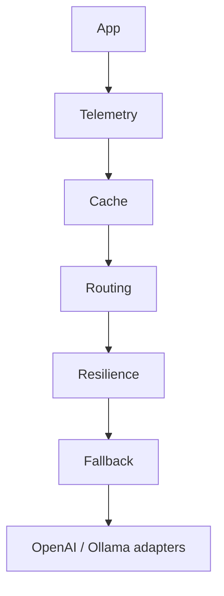

# ModelCore

ModelCore is provider-agnostic Python infrastructure for OpenAI and Ollama. It normalizes chat, streaming, embeddings, structured output, resilience, cache, fallback, telemetry, routing, and safe tool calling.

It is a library, not an agent framework, RAG system, distributed cache, or provider router with live health/pricing data.

## Install

```bash
pip install modelcore[openai]
# or: pip install modelcore[ollama]
```

## Quickstart

```python
from modelcore.config import OpenAIConfig
from modelcore.models import ChatRequest, Message
from modelcore.providers import OpenAIProvider

provider = OpenAIProvider(OpenAIConfig(api_key="..."))
response = await provider.generate(ChatRequest([Message.user("Hello")], model="gpt-5"))
print(response.content)
```

Ollama uses `OllamaConfig()` and `OllamaProvider` identically. See `examples/` for chat, streaming, embeddings, structured output, resilience, fallback, routing, and tools.

## Architecture



Wrappers are explicit and composable; the diagram is not a mandatory order. Capabilities remain segregated: `LLMProvider`, `EmbeddingProvider`, `StructuredOutputProvider`, and `ToolCallingProvider`.

## Examples

```python
# Structured output
result = await StructuredGeneration(provider).generate(request, response_model=Person)

# Resilience and cache
reliable = ResilientProvider(provider, RetryPolicy())
cached = CachingProvider(reliable, MemoryCache(), provider_key="openai:gpt-5", ttl=60)

# Fallback and telemetry
fallback = FallbackProvider([openai_provider, ollama_provider])
observed = TelemetryProvider(fallback, LoggingTelemetrySink(logger))
```

Tool handlers are explicit allowlisted `ToolDefinition`s; ModelCore never executes arbitrary model-produced code.

## OpenTelemetry

Install the optional adapter:

```bash
pip install "modelcore[otel]"
```

Your application remains responsible for configuring its own OpenTelemetry tracer provider and exporter. ModelCore neither configures global telemetry nor requires a collector:

```python
from opentelemetry import trace
from modelcore.application import TelemetryProvider
from modelcore.telemetry.opentelemetry import OpenTelemetrySink

tracer = trace.get_tracer("my_application.modelcore")
observed = TelemetryProvider(provider, OpenTelemetrySink(tracer))
response = await observed.generate(request)
```

The adapter emits one `modelcore.generate` span for a completed normal generation. It includes safe operational metadata (provider, model, duration, success, token usage, and safe error type); it never includes prompts, messages, generated content, tool payloads, credentials, or raw exception text.

## Development

```bash
pip install -e ".[dev,test,openai,ollama,otel]"
python -m pytest
ruff check .
ruff format --check .
mypy src/modelcore
python -m build
```

Real integration tests are opt-in: set `MODELCORE_RUN_INTEGRATION=1` and provider credentials/runtime. They are skipped by default.

## Security and future work

Do not log prompts, generated content, secrets, or raw tool arguments. Tool calls are schema-validated and registry-limited.

Future work: Redis/distributed cache, cache identity for routing/fallback, intermediate telemetry, more providers, streaming recovery, and richer tool workflows.
