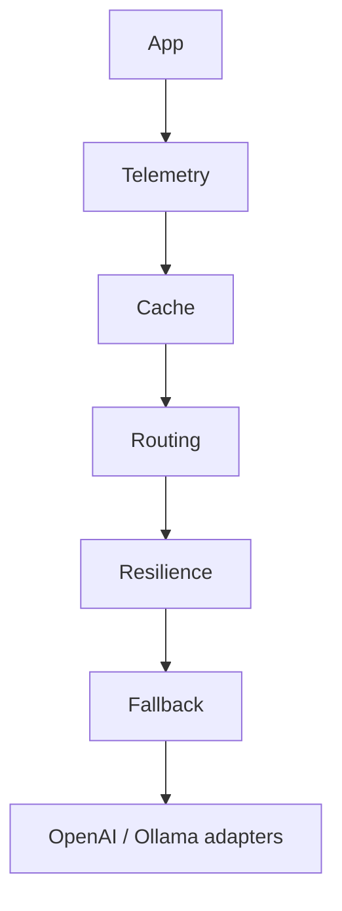

# ModelCore

ModelCore is provider-agnostic Python infrastructure for OpenAI and Ollama. It normalizes chat, streaming, embeddings, structured output, resilience, cache, fallback, telemetry, routing, and safe tool calling.

It is a library, not an agent framework, RAG system, distributed cache, or provider router with live health/pricing data.

## Install

```bash
pip install modelcore[openai]
# or: pip install modelcore[ollama]
```

## Quickstart

```python
from modelcore.config import OpenAIConfig
from modelcore.models import ChatRequest, Message
from modelcore.providers import OpenAIProvider

provider = OpenAIProvider(OpenAIConfig(api_key="..."))
response = await provider.generate(ChatRequest([Message.user("Hello")], model="gpt-5"))
print(response.content)
```

Ollama uses `OllamaConfig()` and `OllamaProvider` identically. See `examples/` for chat, streaming, embeddings, structured output, resilience, fallback, routing, and tools.

## Architecture



Wrappers are explicit and composable; the diagram is not a mandatory order. Capabilities remain segregated: `LLMProvider`, `EmbeddingProvider`, `StructuredOutputProvider`, and `ToolCallingProvider`.

## Examples

```python
# Structured output
result = await StructuredGeneration(provider).generate(request, response_model=Person)

# Resilience and cache
reliable = ResilientProvider(provider, RetryPolicy())
cached = CachingProvider(reliable, MemoryCache(), provider_key="openai:gpt-5", ttl=60)

# Fallback and telemetry
fallback = FallbackProvider([openai_provider, ollama_provider])
observed = TelemetryProvider(fallback, LoggingTelemetrySink(logger))
```

Tool handlers are explicit allowlisted `ToolDefinition`s; ModelCore never executes arbitrary model-produced code.

## Redis cache

Install the optional async Redis adapter:

```bash
pip install "modelcore[redis]"
```

The application owns and injects the `redis.asyncio` client. ModelCore serializes only the normalized `ChatResponse`
as versioned JSON and uses Redis native expiry for positive TTLs:

```python
import redis.asyncio as redis

from modelcore.application import CachingProvider, ResilientProvider, RetryPolicy
from modelcore.cache import RedisCache

client = redis.Redis.from_url("redis://localhost:6379/0")
reliable = ResilientProvider(provider, RetryPolicy())
cached = CachingProvider(
    reliable,
    RedisCache(client, namespace="myapp:modelcore:"),
    provider_key="openai:gpt-5",
    ttl=60,
)
```

Redis is useful when responses must be shared between processes and deployments. Cached responses contain generated
content, so configure Redis access, retention, and encryption according to your privacy requirements. Redis failures
are exposed as `CacheBackendError` or `CacheUnavailableError`; the adapter does not silently apply a best-effort
policy. Stampede protection remains process-local—there is no distributed lock.

## Cache telemetry

Observe any cache backend by composition, without changing `CachingProvider` or the backend's error policy:

```python
from modelcore.application import CachingProvider, MemoryCache, ObservableCacheBackend

observed_cache = ObservableCacheBackend(
    MemoryCache(),
    backend_name="memory",
    sink=cache_telemetry_sink,
)
cached = CachingProvider(provider, observed_cache, provider_key="openai:gpt-5", ttl=60)
```

Cache telemetry emits safe `get` hit/miss/error events and `set` success/error events with duration and explicit
backend identity. It never includes cache keys, prompts, messages, generated content, cached values, Redis connection
details, or credentials. Sink failures are best-effort, while backend failures remain fail-fast and propagate unchanged.

With the optional `modelcore[otel]` adapter, use `OpenTelemetryCacheSink` to create
`modelcore.cache.get` and `modelcore.cache.set` spans. Applications continue to own tracer configuration.

## Retry & fallback telemetry

Retry telemetry observes attempts within the same logical provider; fallback telemetry observes movement between
explicitly named candidates. Both are optional and best-effort, and neither changes retry eligibility, backoff,
fallback order, or propagated exceptions:

```python
primary = ResilientProvider(
    openai_provider,
    RetryPolicy(),
    provider_name="openai",
    telemetry_sink=retry_sink,
)
secondary = ResilientProvider(
    ollama_provider,
    RetryPolicy(),
    provider_name="ollama",
    telemetry_sink=retry_sink,
)
provider = FallbackProvider(
    [primary, secondary],
    provider_names=["openai", "ollama"],
    telemetry_sink=fallback_sink,
)
```

Configured names are operational identities supplied by the application; ModelCore never derives them from provider
classes or responses. Events contain only model and attempt/candidate metadata, durations, delays, outcomes, and safe
error type names—never prompts, messages, generated content, endpoints, credentials, or raw exception text. The
optional OpenTelemetry adapters create `modelcore.retry` and `modelcore.fallback` internal spans.

## Routing telemetry

Routing telemetry observes the initial candidate selected by `RoutingProvider`; it is separate from fallback, retry,
and final generation telemetry. Only the selected `ModelCandidate.key`, configured model, policy identity, candidate
position/count, configured scores, and routing duration are emitted. Prompts, messages, responses, provider
representations, endpoints, and credentials are never included.

Built-in policies expose stable identities (`cheap`, `fast`, `quality`, and `balanced`). External policies must provide
an explicit keyword-only `policy_name` when routing telemetry is enabled. Sink failures are best-effort and cannot
change selection or provider execution. OpenTelemetry is optional; `OpenTelemetryRoutingSink` emits one
`modelcore.routing` `INTERNAL` span per successful decision.

```python
from modelcore.application import CheapPolicy, ModelCandidate, RoutingProvider
from modelcore.telemetry.opentelemetry import OpenTelemetryRoutingSink

router = RoutingProvider(
    CheapPolicy(),
    [ModelCandidate("openai-cheap", provider, "gpt-5", 1, 2, 3)],
    telemetry_sink=OpenTelemetryRoutingSink(tracer),
)
```

## Circuit Breaker

`CircuitBreakerProvider` protects only `generate()` and follows `CLOSED → OPEN → HALF_OPEN`. After the configured
number of transient failures, calls fail fast until the monotonic recovery timeout allows one recovery probe. Retry
recovers an individual call, the circuit breaker stops repeatedly calling a persistently unavailable provider, and
fallback tries another explicitly configured provider.

```python
from modelcore.application import CircuitBreakerPolicy, CircuitBreakerProvider, ResilientProvider

provider = CircuitBreakerProvider(
    ResilientProvider(openai),
    policy=CircuitBreakerPolicy(failure_threshold=5, recovery_timeout=30.0),
)
```

Retry and fallback composition remain consumer choices. Wrapping `ResilientProvider` inside the circuit breaker makes
the breaker observe the final result after retries. `CircuitOpenError` is not made fallback-eligible automatically,
and streaming is delegated unchanged.

## OpenTelemetry

Install the optional adapter:

```bash
pip install "modelcore[otel]"
```

Your application remains responsible for configuring its own OpenTelemetry tracer provider and exporter. ModelCore neither configures global telemetry nor requires a collector:

```python
from opentelemetry import trace
from modelcore.application import TelemetryProvider
from modelcore.telemetry.opentelemetry import (
    OpenTelemetryCacheSink,
    OpenTelemetryFallbackSink,
    OpenTelemetryRetrySink,
    OpenTelemetryRoutingSink,
    OpenTelemetrySink,
)

tracer = trace.get_tracer("my_application.modelcore")
observed = TelemetryProvider(provider, OpenTelemetrySink(tracer))
cache_sink = OpenTelemetryCacheSink(tracer)
retry_sink = OpenTelemetryRetrySink(tracer)
fallback_sink = OpenTelemetryFallbackSink(tracer)
routing_sink = OpenTelemetryRoutingSink(tracer)
response = await observed.generate(request)
```

The adapters emit generation, cache-operation, retry-attempt, and fallback-candidate spans containing only safe
operational metadata; they never include prompts, messages, generated content, cache keys or values, tool payloads,
credentials, endpoints, or raw exception text.

## Development

```bash
pip install -e ".[dev,test,openai,ollama,otel,redis]"
python -m pytest
ruff check .
ruff format --check .
mypy src/modelcore
python -m build
```

Real provider integration tests are opt-in: set `MODELCORE_RUN_INTEGRATION=1` and provider credentials/runtime. The
Redis integration test separately requires `MODELCORE_RUN_REDIS_INTEGRATION=1` and optionally `MODELCORE_REDIS_URL`.
They are skipped by default.

## Security and future work

Do not log prompts, generated content, secrets, or raw tool arguments. Tool calls are schema-validated and registry-limited.

Future work: distributed cache locking, cache identity for routing/fallback, intermediate telemetry, more providers,
streaming recovery, and richer tool workflows.
